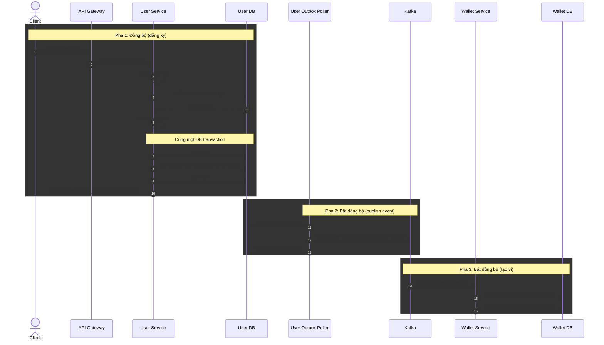
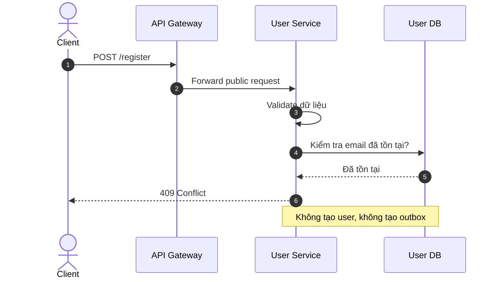
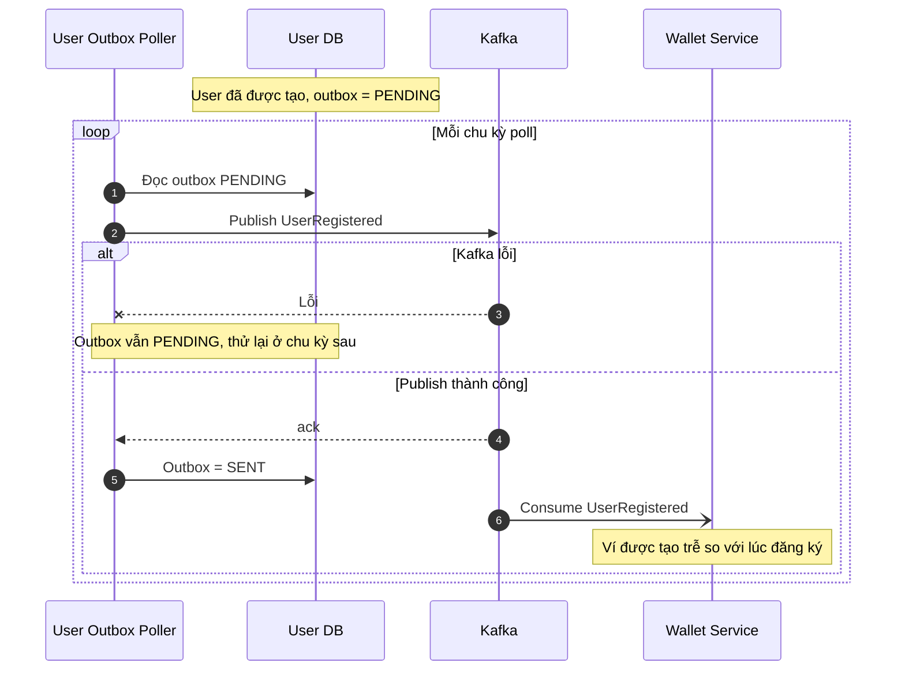
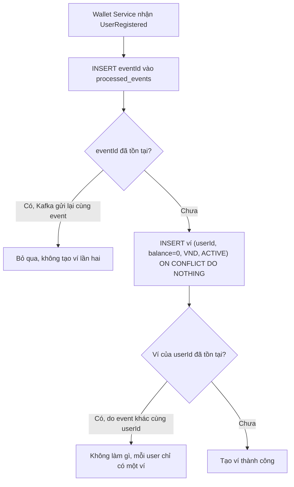
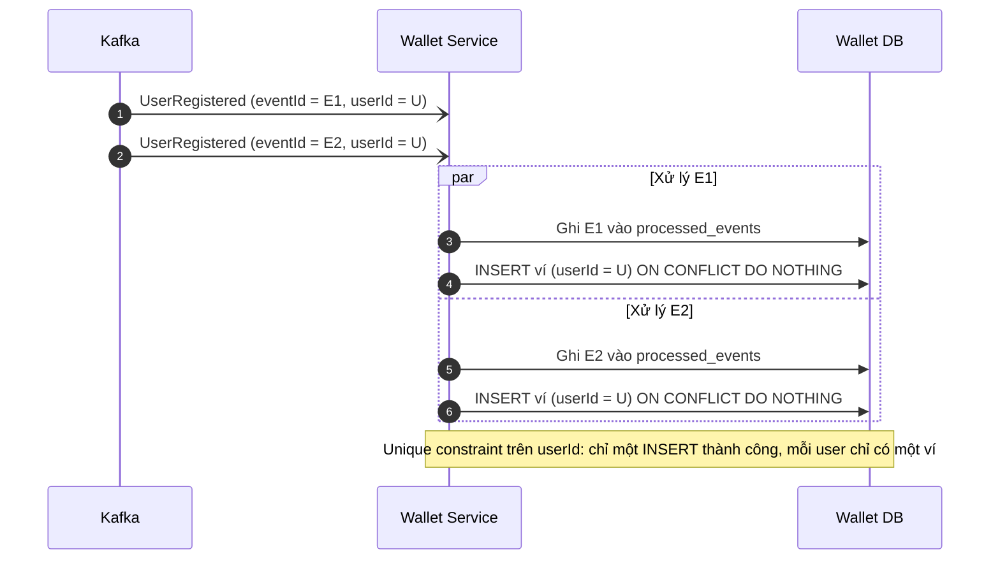
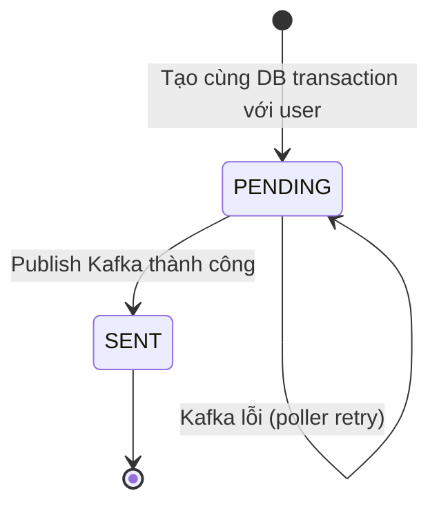

# Đăng ký tài khoản → Outbox → Kafka → tự động tạo ví

## 1. Luồng chính: đăng ký đồng bộ, tạo ví bất đồng bộ

## 2. Nhánh lỗi: email đã tồn tại

## 3. Kafka tạm thời lỗi: outbox giữ PENDING để retry

## 4. Consumer: xử lý event trùng và chống tạo ví lặp

## 5. Hai event khác nhau cùng userId

## 6. Vòng đời Outbox event

