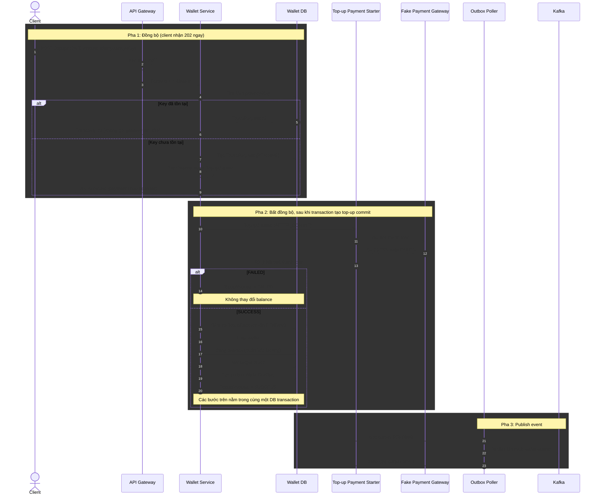
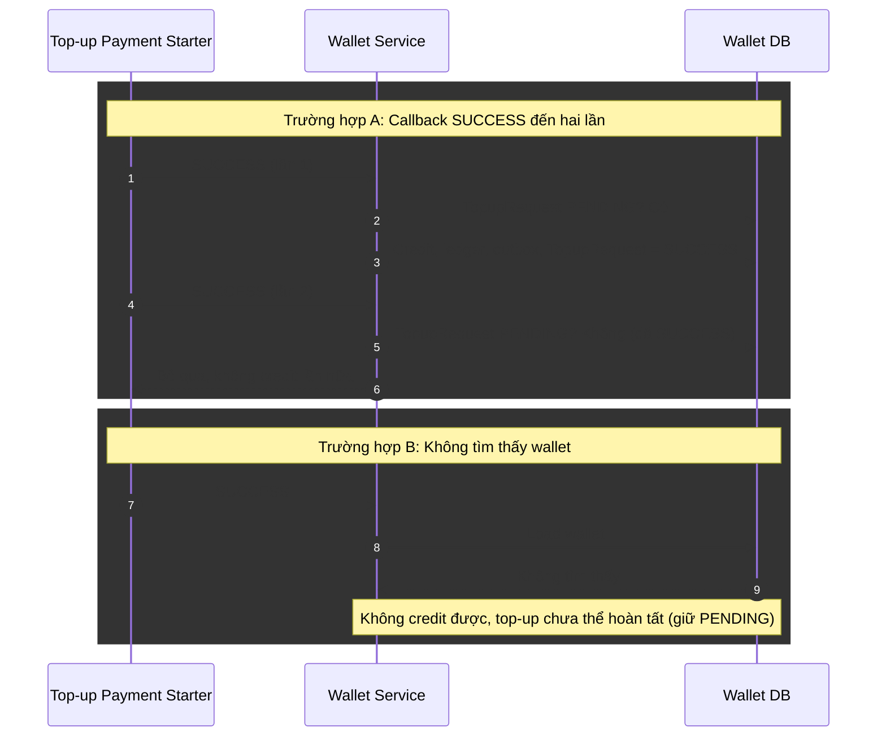
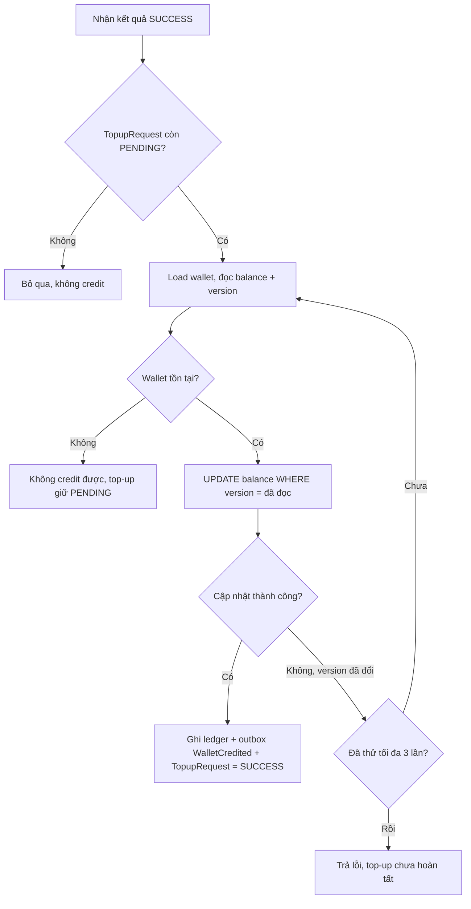
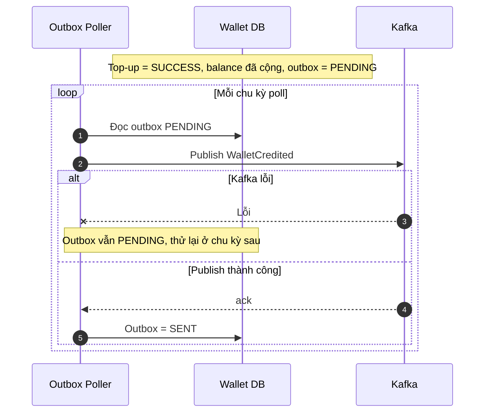
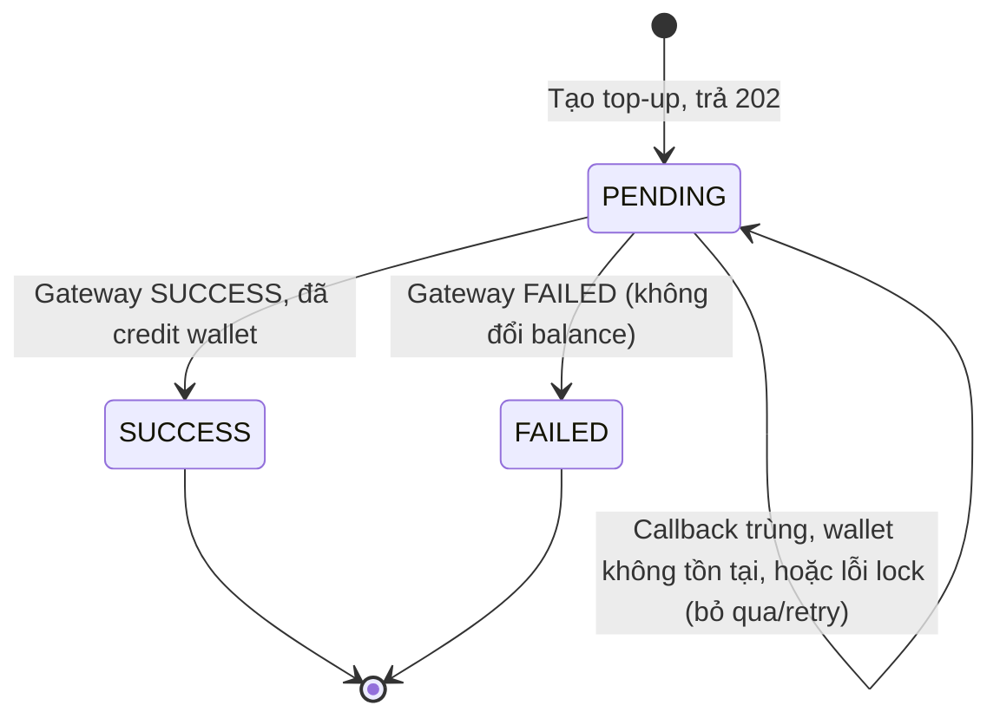
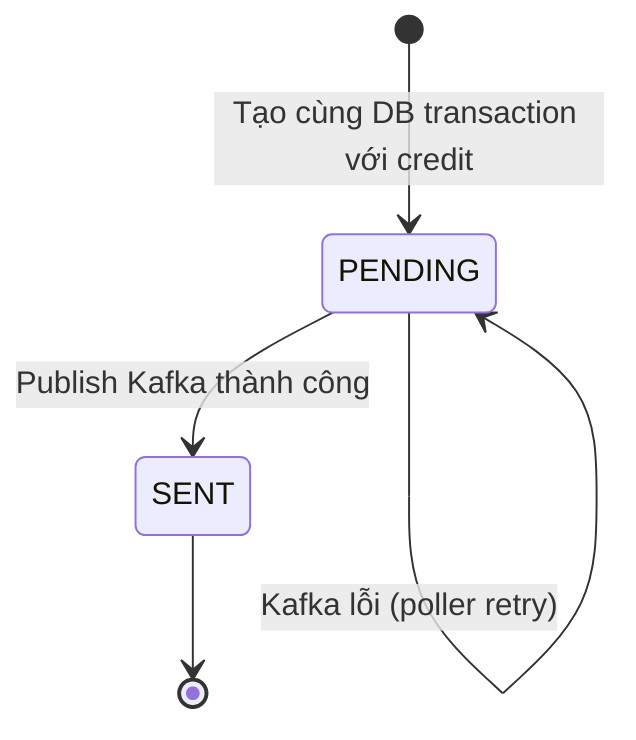
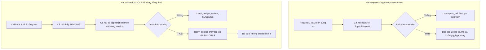

# Top-up bất đồng bộ với Fake Payment Gateway và Outbox

## 1. Luồng chính: 202 trước, payment và credit sau commit

## 2. Nhánh lỗi khi xử lý kết quả thanh toán

## 3. Optimistic lock conflict khi credit

## 4. Kafka lỗi: outbox giữ PENDING để retry

## 5. Vòng đời trạng thái TopupRequest

## 6. Vòng đời trạng thái Outbox event

## 7. Xử lý đồng thời

