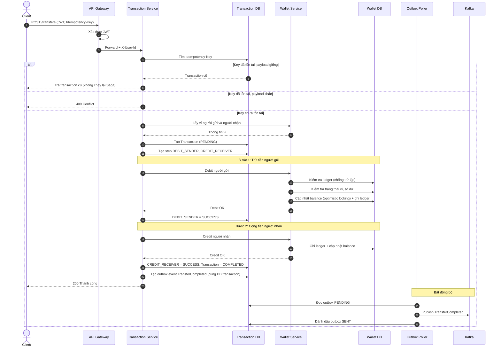
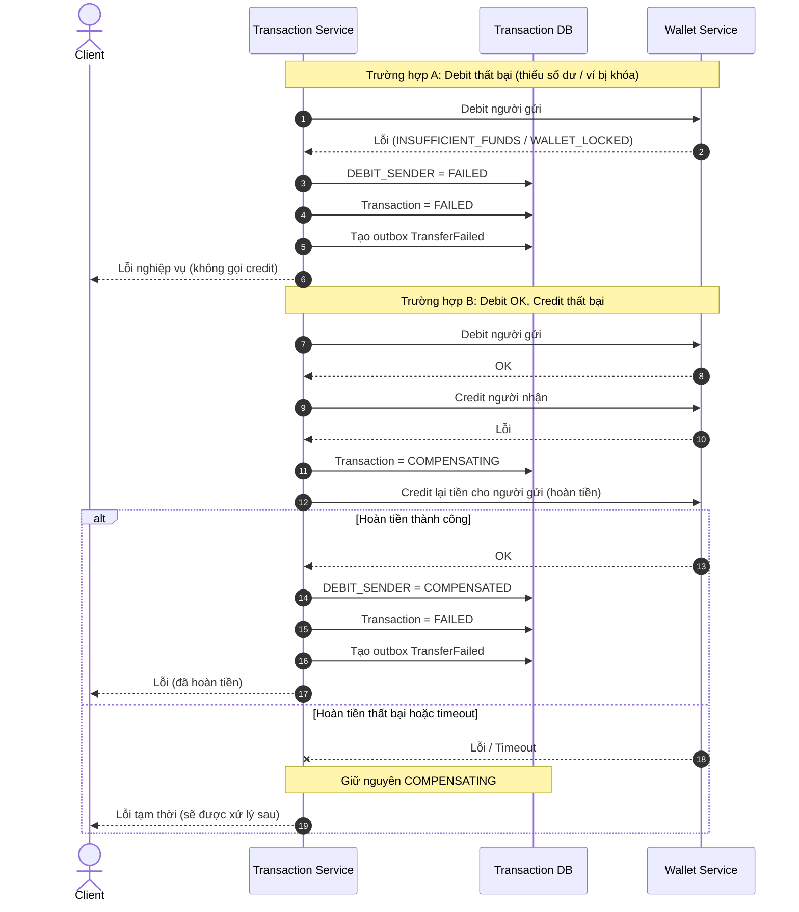
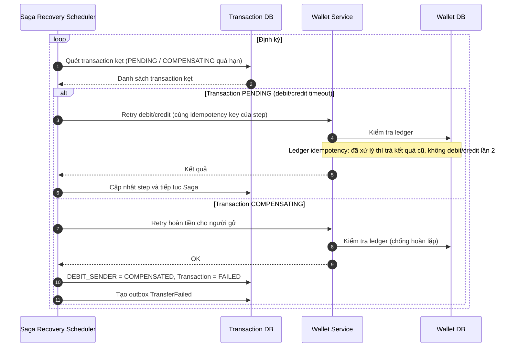
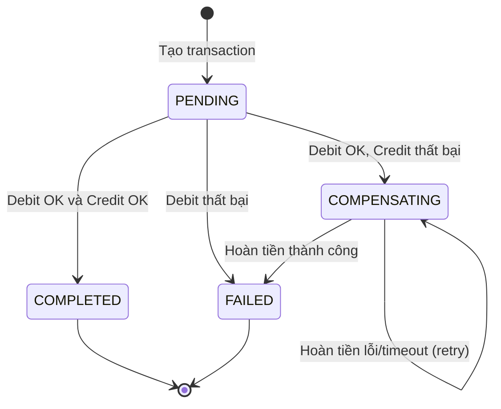
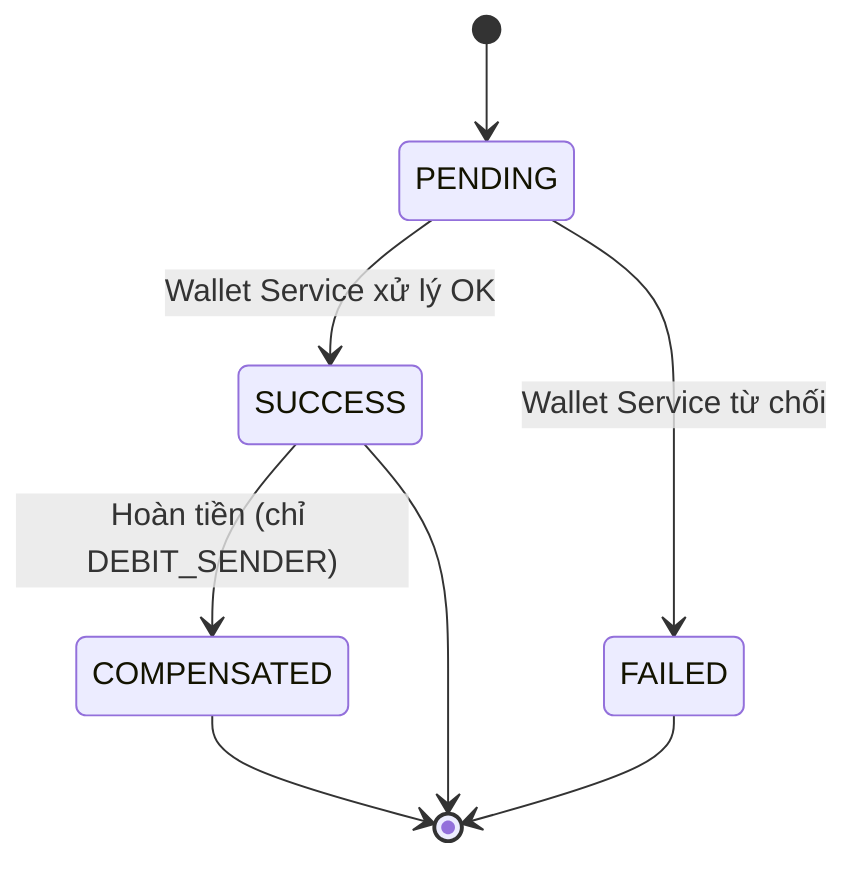
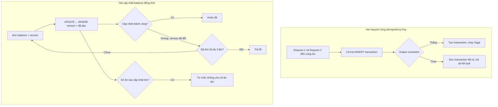

# Transfer Saga: chuyển tiền, bồi hoàn và phục hồi

## 1. Luồng chính (happy path)

## 2. Nhánh lỗi: debit thất bại và bồi hoàn

## 3. Phục hồi: Saga Recovery Scheduler

## 4. Vòng đời trạng thái Transaction

## 5. Trạng thái của từng Saga step

## 6. Xử lý đồng thời

